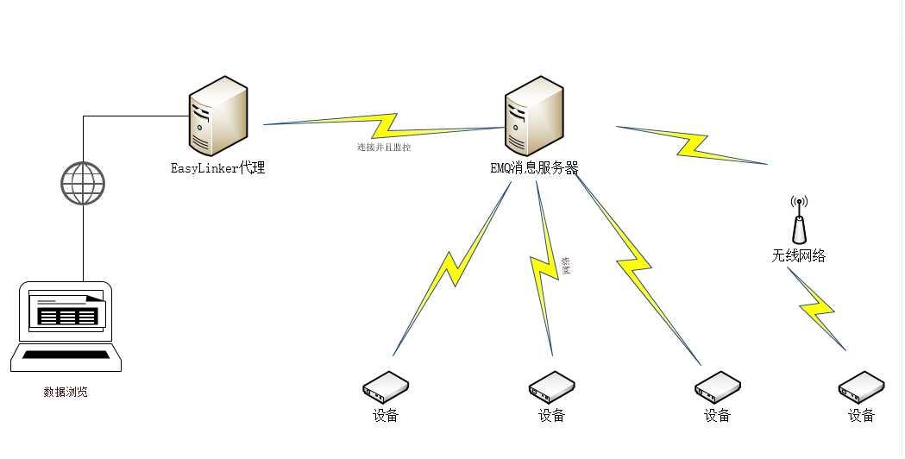

# EasyLinker V2.0
### 学习群：475512169
# 一些附件
>paho库
http:www.eclipse.org/paho/  
qmqtt:https://github.com/emqtt/qmqtt   
EMQ下载地址:http://emqtt.com/downloads
### 安装教程 :http://www.easylinker.xyz/t/4
### EasyLinker-EMQ : https://git.coding.net/ChildeWWH/EMQ_Easylinker.git
# 前言
 
>本人是电子信息工程理工科男一枚，标准技术宅。本应该去研究CPU架构和汇编语言的我，却迷上了WEB互联网开发。加上平时喜欢折腾一些极客玩具，渐渐的对硬件也来了兴趣。
平日里酷爱折腾一些极客玩具的我，再加上本人身处硬件相关专业，平时接触到了很多不一样的问题。问题总是围绕在身边。
比如，某同学在做STM32单片机的时候抱怨：“我要是把拿到的数据用软件存储起来就好了，到时候直接拿出来观察结果数据。”再者还有：“要是能把单片机的数据传输到网络里面就好了，可以随便查看。”
这些都是来自硬件工程师的抱怨和难处：硬件不负责数据的可视化呈现，他们更喜欢用各种仪器去查看。
我想：能否解决这个问题？让这些硬件工程师随时可以查看数据，用手机，用浏览器，APP，都可以观测结果，即打造一个“通用的平台，用来让硬件把数据传递到互联网。
于是自己着手试了一下，在很长的时间里，尝试了很多方法，也解决了一部分问题，但是总是不完美，
期间用了Python在树莓派上实现一个数据呈现平台，但是不理想，折腾许久，
最终决定用Java来实现这个平台。这就是这个项目的来源，含义就是：让一切联网变得更加容易.  
>  

>1．	EasyLinker介绍  
    众所周知，在物联网开发过程中，网络是至关重要的，可以说，离开互联网网络，物联网就没有意义。因为网络通信很重要，所以网络协议开发几乎成了一个嵌入式工程师必备的技能。由于不同的硬件性能不一样，很多协议开发起来也是非常麻烦，导致了很多硬件底层开发人员在面对低级硬件芯片接入网络这个问题时压力重重。  
    EasyLinker是一个高度抽象了硬件设备通过网络接入互联网协议层的中间层云计算平台。提供了一个通用的接口，任何主流芯片，只要通过规范的接口，都可以通过简单的编码接入到网络中，简化了程序开发，提高了开发效率。  
2．	EasyLinker使用场景  
（1）	·家庭物联网  
利用简单的代码，快速搭建只能家具控制中心；  
（2）	·企业物联网  
不需要专业的设备，快速构建企业内部物联网络；  
（3）	·农业生产  
快速创建一个智能农业控制管理平台；  
（4）	·工业控制  
快速搭建，简化工业控制，解放劳动力。  
3．	EasyLinker优势  
和传统的物联网平台相比，EasyLinker具有以下优势：  
（1）·代码完全开源：任何人都可以进行二次开发，没有技术细节，全部透明，安全性能好；  
（2）·轻量级：单个服务器到分布式集群都支持；  
（3）·门槛低：学习成本下降，相比于构建传统大型物联网，EasyLinker对比更加简单，因为封装了通信过程，所以学习变得更加容易，使得开发人员只需关注业务本身，而不是具体的技术细节；  
（4）·部署简单：核心部件仅有两部分，没有技术的人员也可以轻松安装部署.  


# 新版特点

>  新版特点  
1.新版本全部采用REST接口形式形式，方便扩展;  
2.加入了Swagger-API插件动态显示文档的功能;  
3.增加设备管理器，随时查看设备的资源和状态;  
4.拟增加Node.js脚本支持，便于用户自定义策略;  
5.增加物理网常用API接口(天气，温度，湿度等等);   
6.附带一个微型博客，用户共享示例; 
7.附带一个APP来管理后台设备;
>
# 架构图  
  

# 配置教程  
## EasyLinker配置  
application.properties配置
```aidl
###################################################################################################
#server
#####################################################################################################
server.port=1314
spring.http.encoding.charset=utf8
spring.http.encoding.force=true
spring.http.multipart.maxFileSize=10Mb
spring.http.multipart.maxRequestSize=10Mb
#开启对AOP的支持
spring.aop.auto=true
#设置代理模式 true（cglib） false(java JDK代理)
spring.aop.proxy-target-class=true
####################################################################################################
####################################################################################################
spring.datasource.driver-class-name=com.mysql.jdbc.Driver
spring.datasource.url=jdbc:mysql://localhost:3306/easylinker_dev?autoReconnect=true&useUnicode=true&characterEncoding=utf8&useSSL=true
spring.datasource.password=easylinker_dev
spring.datasource.username=easylinker_dev
spring.datasource.tomcat.validation-query=SELECT 1
spring.datasource.dbcp2.test-on-borrow=true
server.tomcat.uri-encoding=UTF-8
#####################################################################################################
#JPA Configuration:
#####################################################################################################
spring.jpa.database=MYSQL
spring.jpa.open-in-view=true
spring.jpa.show-sql=false
spring.jpa.generate-ddl=true
spring.jpa.hibernate.ddl-auto=update
######################################################################################################
###mail setting
######################################################################################################
spring.mail.host=smtp.qq.com
spring.mail.username=你的邮箱
spring.mail.password=密码（口令，非登录密码）
spring.mail.properties.mail.smtp.auth=true
spring.mail.properties.mail.smtp.starttls.enable=true
spring.mail.properties.mail.smtp.starttls.required=true
######################################################################################################
######################################################################################################
#EMQ server 请替换成自己的EMQ安装服务器
######################################################################################################
easylinker.emq.host=tcp://localhost
easylinker.emq.api.host=http://localhost:8080/api/v2/
easylinker.emq.api.user=admin
easylinker.emq.api.password=public
######################################################################################################
######################################################################################################
#又拍云（请换成自己的）
######################################################################################################
upyun.account.bucketname=bucketname
upyun.account.username=username
upyun.account.password=password
upyun.account.apiKey=apikey
######################################################################################################


```
## 2.EMQ配置  
acl.conf
```aidl 
%%--------------------------------------------------------------------
%%
%% [ACL](https://github.com/emqtt/emqttd/wiki/ACL)
%%
%% -type who() :: all | binary() |
%%                {ipaddr, esockd_access:cidr()} |
%%                {client, binary()} |
%%                {user, binary()}.
%%
%% -type access() :: subscribe | publish | pubsub.
%%
%% -type topic() :: binary().
%%
%% -type rule() :: {allow, all} |
%%                 {allow, who(), access(), list(topic())} |
%%                 {deny, all} |
%%                 {deny, who(), access(), list(topic())}.
%%
%%--------------------------------------------------------------------
{allow, all, subscribe, ["$SYS/brokers/+/clients/+/connected","$SYS/brokers/+/clients/+/disconnected"]}.
%%{allow, all, subscribe, ["$SYS/#", "#"]}.
%%{allow, all, subscribe, ["$SYS/#", {eq, "#"}]}.
%%{allow, all, subscribe, ["#"]}.
```
emq_auth_mysql.conf(数据库信息改成你自己的)
```aidl
##--------------------------------------------------------------------
## MySQL Auth/ACL Plugin
##--------------------------------------------------------------------

## MySQL Server 3306, 127.0.0.1:3306, localhost:3306
auth.mysql.server = 127.0.0.1:3306
## Mysql Pool Size
auth.mysql.pool = 8
## Mysql Username
auth.mysql.username =easylinker_dev
## Mysql Password
auth.mysql.password =easylinker_dev
## Mysql Database
auth.mysql.database = easylinker_dev

auth.mysql.auth_query = select open_id as password from device where open_id = '%u' limit 1
auth.mysql.password_hash = plain
auth.mysql.acl_query = select allow , ip_address, open_id AS username , client_id AS clientid , access, topic from device  where  open_id ='%u'
```
emq.conf(这两处修改为以下值)
```aidl
mqtt.allow_anonymous = false
mqtt.acl_nomatch = allow
```
##启动方式
```aidl
# 启动emqttd
./bin/emqttd start

# 检查运行状态
./bin/emqttd_ctl status

# 停止emqttd
./bin/emqttd stop
```
# 客户端连接代码DEMO
## 1.Python客户端代码示例(控制树莓派40号引脚的电平)
```
#说明：需要安装paho-mqt库,命令:pip install paho-mqtt
#[8305132bc868fa613dfa2fa3eac6053a] 这个是设备的openId
import RPi.GPIO as GPIO
import paho.mqtt.client as mqtt
import time
GPIO.setmode(GPIO.BOARD)
GPIO.setup(40, GPIO.OUT)

def on_connect(client, userdata, flags, rc):
    print("Connected Success! "+str(rc))
    client.subscribe("device/8305132bc868fa613dfa2fa3eac6053a")
    file = open("/sys/class/thermal/thermal_zone0/temp")
    temp = float(file.read()) / 1000
    data={ "qos":1, "retain":"true","unit":"C", "message":str(temp)}
    client.publish("device/8305132bc868fa613dfa2fa3eac6053a", str(data))     
    file.close()
    time.sleep(6)

def on_message(client, userdata, msg):
    print("received:"+str(msg.payload))
    if(str(msg.payload)=="ON"):
        GPIO.output(40, GPIO.LOW)
    elif(str(msg.payload)=="OFF"):
        GPIO.output(40, GPIO.HIGH)

client = mqtt.Client("8305132bc868fa613dfa2fa3eac6053a")
client.on_connect = on_connect
client.on_message = on_message
client.username_pw_set("8305132bc868fa613dfa2fa3eac6053a","8305132bc868fa613dfa2fa3eac6053a")
client.connect("192.168.3.64", 1883, 60)
client.loop_forever()
```


